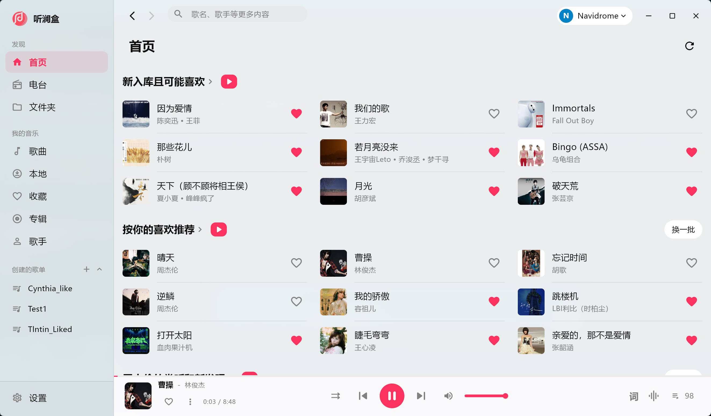
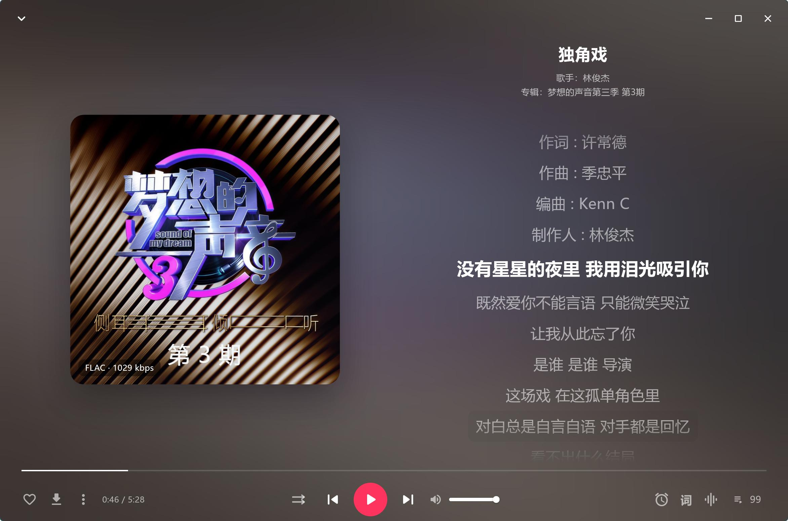
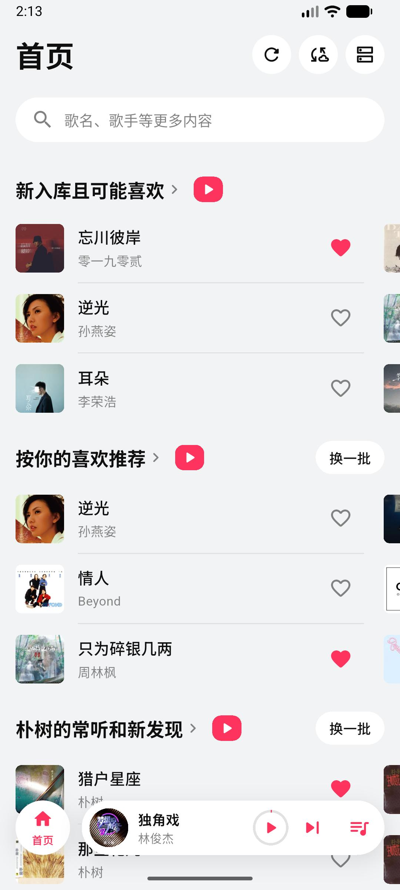
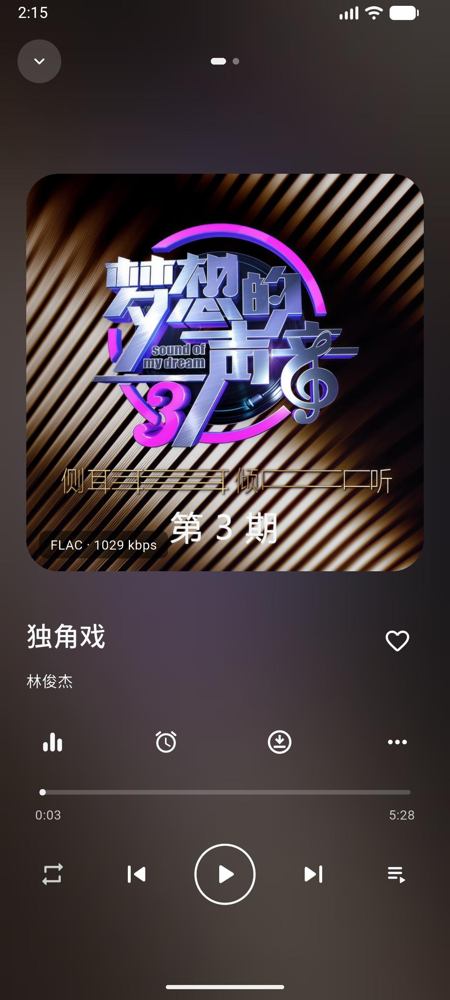
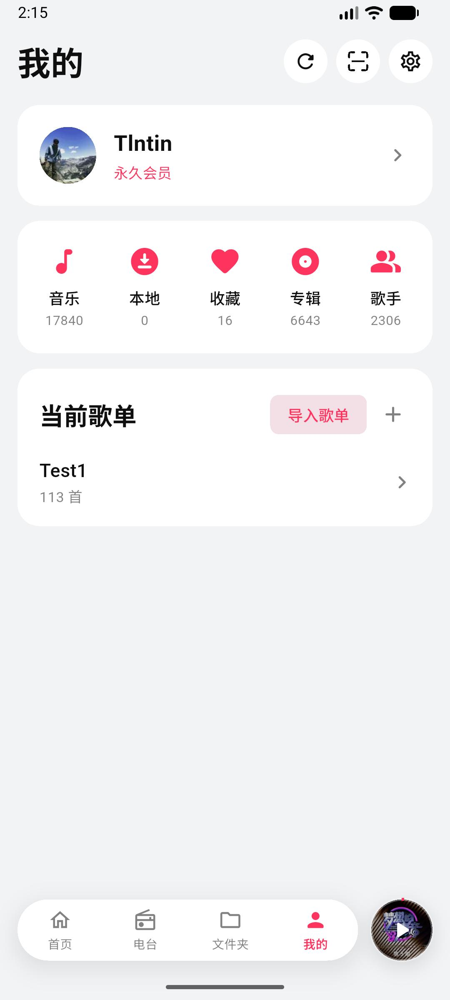
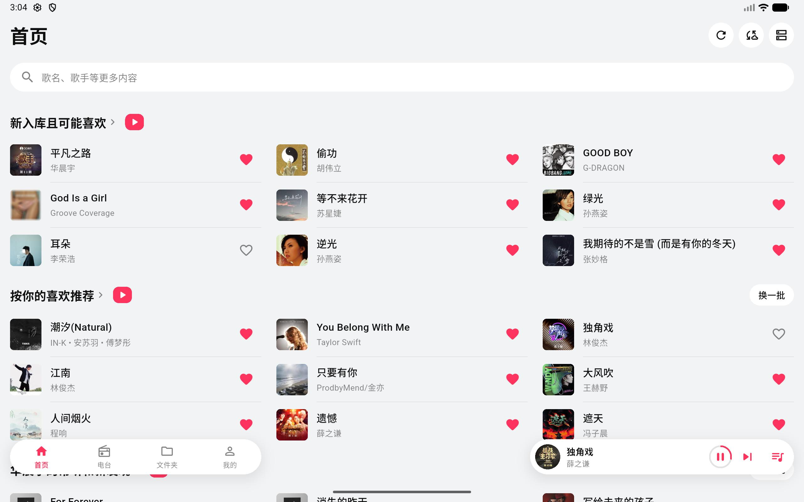
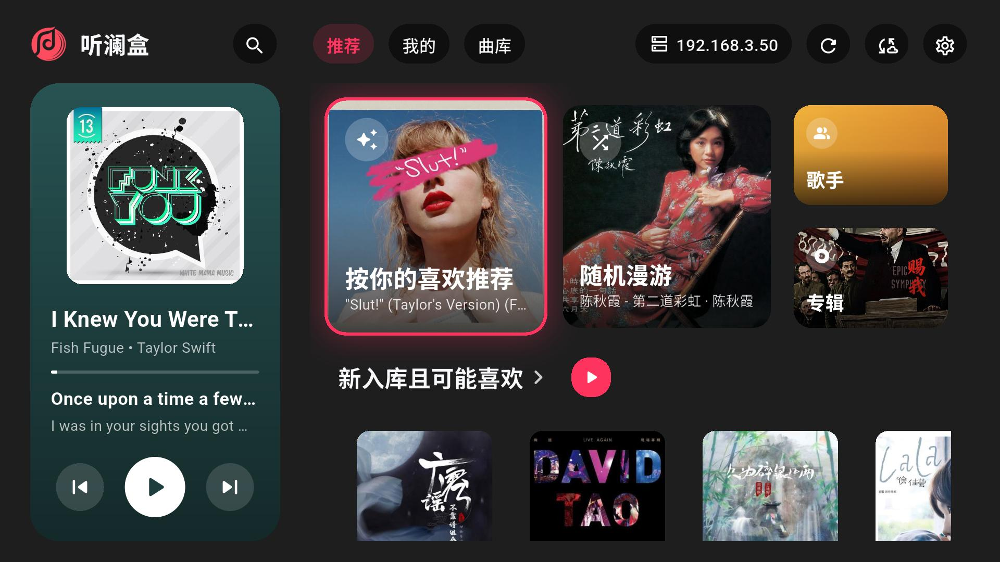

<div align="center">


# 听澜盒

连接你自己的音乐库：Navidrome / Subsonic、Emby、Jellyfin、飞牛音乐、Audiobookshelf、WebDAV、SMB、百度网盘与本地文件。

Android（手机 / 平板 / 电视 / 车机）· Windows · HarmonyOS

简体中文 | [English](README.en.md)

[官网](https://music.http5.cn/) · [使用文档](https://music.http5.cn/docs/quickly_start.html) · [更新日志](https://music.http5.cn/changelog.html)

</div>

> 本仓库只用于发布安装包和收集反馈，不包含源码。

## 截图

**电脑**

<p align="center">
  
  
</p>

**手机**

<p align="center">
  
  
  
  
</p>

**平板 / 电视**

<p align="center">
  
  
</p>

## 下载

| 渠道 | 地址 |
|---|---|
| 国内（GitCode） | <https://gitcode.com/Tlntin/SonaWave-Release/releases> |
| GitHub | <https://github.com/Tlntin/SonaWave-Release/releases/latest> |
| 鸿蒙（华为应用市场） | <https://appgallery.huawei.com/app/detail?id=com.tlntin.sonawave> |

两个仓库的安装包完全一样，选速度快的就行。

### 下哪个文件

**Android（Android 7.0 及以上，含 Android TV / 车机）**

华为 / 荣耀装 HarmonyOS 2~4 的老机型也能装 APK；HarmonyOS 5（纯血鸿蒙）及以上请到华为应用市场下载鸿蒙版。

| 文件 | 适用 |
|---|---|
| `SonaWave-<版本>-android-arm64-v8a.apk` | 绝大多数手机、平板、电视 / 盒子、车机，**不确定就选这个** |
| `SonaWave-<版本>-android-armeabi-v7a.apk` | 老款电视盒子、32 位设备（装 arm64 版提示「解析错误」时换这个） |
| `SonaWave-<版本>-android-x86_64.apk` | 电脑上的安卓模拟器 |

**Windows（Windows 10 / 11，64 位）**

| 文件 | 说明 |
|---|---|
| `…-windows-x64-full-setup.exe` | **推荐**。完整版播放内核：DSD、均衡器、网络流兼容性最好 |
| `…-windows-x64-lite-setup.exe` | 精简版，体积不到完整版的一半，常见格式都能放；少数冷门格式和网络流的兼容性不如完整版 |

安装包装到当前用户目录，不需要管理员权限；覆盖安装即可升级，设置和曲库都会保留。

**Linux / macOS / iOS**：暂未提供。

### 校验

每个版本附带 `SHA256SUMS.txt`。下载后可以核对：

```powershell
# Windows PowerShell
Get-FileHash .\SonaWave-<版本>-windows-x64-full-setup.exe -Algorithm SHA256
```

```bash
# Linux / macOS
sha256sum -c SHA256SUMS.txt --ignore-missing
```

### 安装时的提示

- **Windows 弹出「Windows 已保护你的电脑」**：安装包暂未做代码签名，点「更多信息」→「仍要运行」。请只从上面列出的地址下载。
- **Android 提示「禁止安装未知来源应用」**：按提示允许浏览器 / 文件管理器安装应用即可。
- **电视 / 盒子**：把 APK 拷到 U 盘，用盒子自带的文件管理器安装；或用「当贝助手」之类的工具推送。

## 功能

- **多种音源**：Navidrome / Subsonic、Emby、Jellyfin、飞牛音乐、Audiobookshelf（有声书）、WebDAV、SMB（Windows）、百度网盘、本机文件夹，可同时添加多个
- **播放**：无损、CUE 分轨，Windows 完整版支持 DSD（dsf / dff）；均衡器；Windows 独占输出；边下边播与离线下载
- **歌词**：同步歌词、逐字歌词、歌词翻译；电脑桌面歌词
- **发现**：按你的喜欢推荐、搜索联想、听歌统计；网络电台
- **整理**：收藏、歌单，M3U / TXT 歌单导入
- **多设备**：手机 / 平板 / 电脑自适应布局；Android TV 与车机遥控器操作；系统媒体控制（Windows 媒体浮窗、安卓通知栏 / 锁屏 / 蓝牙）
- 简体中文、繁體中文、English 三语界面，深色模式

## 各版本功能对比

✅ 已支持 · 🚧 部分支持 · ❌ 暂不支持 · — 不适用。鸿蒙版在华为应用市场，其余三列是本仓库发布的安卓 / Windows 版。

| 音源 | 鸿蒙 | 安卓手机 / 平板 | 安卓电视 / 车机 | Windows |
|---|:-:|:-:|:-:|:-:|
| Navidrome / Subsonic、Emby、Jellyfin | ✅ | ✅ | ✅ | ✅ |
| 飞牛音乐 | ✅ | 🚧 不支持转码、文件夹 | 🚧 同左 | 🚧 同左 |
| Audiobookshelf | ✅ 有声书 + 播客 | 🚧 有声书按专辑播放，不支持播客 | 🚧 同左 | 🚧 同左 |
| WebDAV、百度网盘、本地音乐 | ✅ | ✅ | ✅ | ✅ |
| SMB | ✅ | ❌ | ❌ | ✅ |
| 华为云空间 | ✅ | — | — | — |
| 多服务器、多地址自动切换、曲库同步到本机 | ✅ | ✅ | ✅ | ✅ |
| 一个服务器下选多个音乐库 | ✅ | ❌ | ❌ | ❌ |

| 播放 | 鸿蒙 | 安卓手机 / 平板 | 安卓电视 / 车机 | Windows |
|---|:-:|:-:|:-:|:-:|
| 无损、CUE 分轨、均衡器、回放增益、淡入淡出、定时关闭 | ✅ | ✅ | ✅ | ✅ |
| DSD（dsf / dff） | ✅ 实验性 | 未验证 | 未验证 | ✅ 完整版 |
| 独占输出 | ✅ USB 解码器 | ❌ | ❌ | ✅ WASAPI |
| 边下边播、离线下载 | ✅ | ✅ | ✅ | ✅ |
| 服务器转码 | ✅ | 🚧 飞牛不支持 | 🚧 同左 | 🚧 同左 |
| 倍速播放 | ✅ 听书模式 | ❌ | ❌ | ❌ |
| 网络电台 | ✅ | ✅ | 🚧 不能导入 / 导出文件 | ✅ |

| 歌词 | 鸿蒙 | 安卓手机 / 平板 | 安卓电视 / 车机 | Windows |
|---|:-:|:-:|:-:|:-:|
| 同步歌词、逐字歌词、歌词翻译、编辑歌词 | ✅ | ✅ | ✅ | ✅ |
| 逐句校准时间轴 | ✅ | 🚧 只能整体偏移 | 🚧 同左 | 🚧 同左 |
| 桌面 / 悬浮歌词 | ✅ | ❌ | ❌ | ✅ |
| 车载蓝牙歌词 | ✅ | ❌ | ❌ | — |

| 曲库与歌单 | 鸿蒙 | 安卓手机 / 平板 | 安卓电视 / 车机 | Windows |
|---|:-:|:-:|:-:|:-:|
| 首页智能推荐、搜索联想、收藏、多选批量操作、听歌统计 | ✅ | ✅ | ✅ | ✅ |
| 文件夹浏览 | ✅ | 🚧 飞牛 / Audiobookshelf 不支持 | 🚧 同左 | 🚧 同左 |
| 文件夹管理（新建 / 重命名 / 移动 / 删除） | ✅ | ❌ | ❌ | ❌ |
| 歌单：新建、添加歌曲、删除、导入 | ✅ | 🚧 只支持服务器音源 | 🚧 同左，不能导入 | 🚧 只支持服务器音源 |
| 歌单：重命名、排序、移除歌曲、导出 | ✅ | ❌ | ❌ | ❌ |
| 标签编辑 | ✅ | 🚧 只支持 Emby / Jellyfin / 飞牛 | 🚧 同左 | 🚧 同左 |
| 元数据补齐、相似歌曲、历史播放列表、分享 | ✅ | ❌ | ❌ | ❌ |
| 听书模式（书架、续播、倍速）、书城 | ✅ | ❌ | ❌ | ❌ |

| 系统与账号 | 鸿蒙 | 安卓手机 / 平板 | 安卓电视 / 车机 | Windows |
|---|:-:|:-:|:-:|:-:|
| 系统媒体控制（通知栏 / 锁屏 / 耳机按键 / 媒体浮窗） | ✅ | ✅ | ✅ | ✅ |
| 跨设备接续、投播 | ✅ | ❌ | ❌ | ❌ |
| 遥控器操作 | — | — | ✅ | — |
| 托盘、快捷键、拖文件播放、打开方式 | — | — | — | ✅ |
| 登录 | ✅ 华为帐号 | ✅ 邮箱 / 扫码 | ✅ 邮箱 / 扫码 | ✅ 邮箱 / 扫码 |
| 会员（各平台通用） | ✅ 华为支付 | ✅ 支付宝 | ✅ 支付宝 | ✅ 支付宝 |
| 主题、强调色、深色模式、简繁英三语 | ✅ | ✅ | ✅ | ✅ |
| 导出 / 导入配置 | ✅ | ✅ | 🚧 还不能选文件 | ✅ |

## 反馈

遇到问题或有建议，请在 [Issues](../../issues) 里新建问题，最好写上：

- 系统和设备（例如 Windows 11、小米 14、当贝盒子 B1）
- 听澜盒版本（「我的」→「关于」）
- 用的是哪种音源（Navidrome、Emby、SMB…）
- 怎么复现，有截图更好

**请不要在 Issue 里贴服务器地址、账号密码或令牌。**

### 附上调试日志

播放失败、连不上服务器这类问题，有调试日志会快很多：

1. 打开「我的」→ 右上角「设置」→「高级设置」→「调试日志」，打开「记录调试日志」。
2. **不要重启 App**，回去把出问题的操作再做一遍。
3. 回到「调试日志」，点右上角「复制」。
4. 把日志粘贴到邮件里发到 **tlntindeng01@gmail.com**，并在 Issue 里说一声「日志已发邮件」。

日志里的密码和令牌已经自动抹掉，但仍然带着你的服务器地址，**请不要直接贴到 Issue 里**。调试日志只记录本次启动以后的内容，排查完可以把开关关掉。

## 协议

- [用户协议](https://music.http5.cn/flutter-terms.html)
- [隐私政策](https://music.http5.cn/flutter-privacy.html)
- [会员服务协议](https://music.http5.cn/flutter-member.html)
